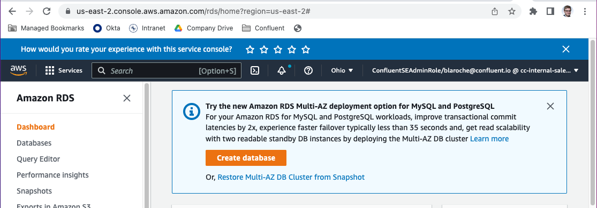
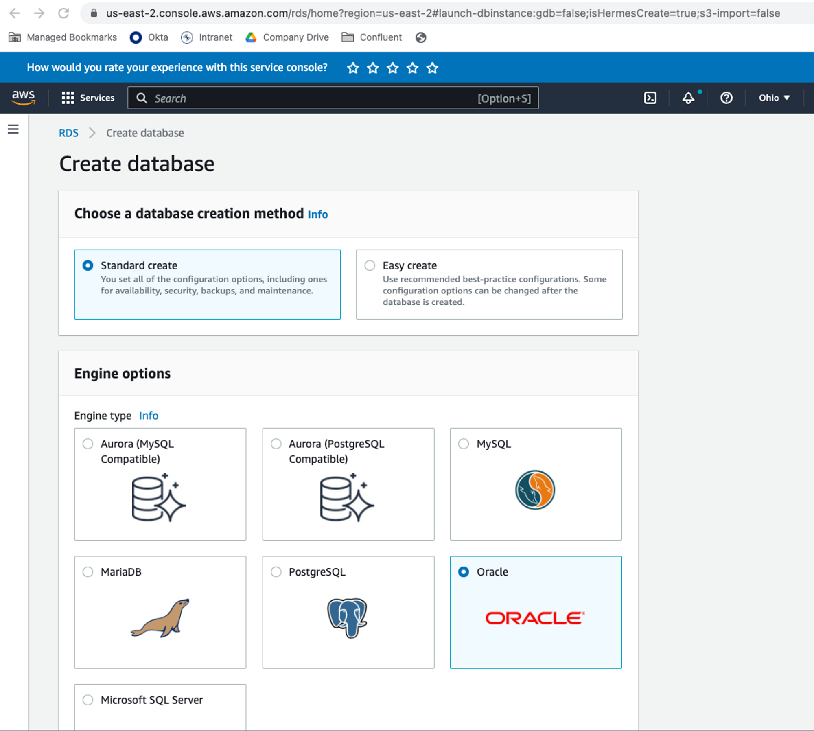
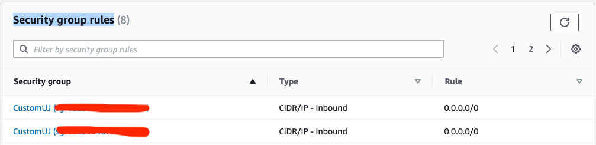

# Oracle-Confluent-MongoDB
Migrate Oracle data to MongoDB with Confluent Cloud

The following __"Hands-on Lab"__ will allow you to migrate Oracle data to MongoDB with the use of the Confluent Cloud.  Depending on your familiarity with MongoDB and The Confluent Cloud and the AWS management console, the lab can be anywhere from 60 to 90 minutes in total. 

## Create an Oracle Database 

We begin by creating an AWS RDS instance of Oracle.  Log into your AWS Console and navigate to "RDS".  
[https://console.aws.amazon.com](https://console.aws.amazon.com)

  


If you want the free teier and least cost for all three servcies in AWS (Oracle RDS, MongoDB Atlas, Confluent Cloud) then I suggest Oregon US West 2. Pick a Region... any region, but pick the same region for Oracle, Confluent Cloud, and MongoDB Atlas. Seriously same cloud provider and same region for all 3 services.  Why? Well there is this thing called egress traffic and it has a cost associated with it. If you deploy in production across multiple regions its just a matter of time before your manager schedules a rather unpleasant meeting with you. Also if you deploy across regions or cloud providers there is a whole networking discussion that is outside the scope of this hands-on lab.  Suffice it to say if you don't listen to me now, you will find out later. (I told you)

For those of you who skim over a paragraph: **Pick the same region for Oracle, Confluent Cloud, and MongoDB Atlas: Oregon US West 2**  


|[Click here to watch a 5 Minute Video on how to create an Oracle instance in AWS](https://youtu.be/exK1K9MT5L4)|   
|<a href="https://youtu.be/FTIlO-GZ9uo" target="video"></a>|  

[Hands on example video to install an Oracle instance](https://youtu.be/FTIlO-GZ9uo)


  

Modify the Security group rules and add a 0.0.0.0/0 route for inbound and outbound traffic.  Networking is outside the scope of this simple tutorial. Never do this with an offical environment, but its fine for this demo.  You can go back later and remove these wide open ranges when you gtethe IP information for Confluent Cloud, but for now this works.

  

## Create the Customer Orders Schema and Populate it With Data

We begin by using the sample "Customer Orders" schema provided by Oracle Developer Advocate Chris Saxon
|Description                            | Link                                                  | 
|-----------------------------------------------|-----------------------------------------------|
| Orginal Blog| [https://blogs.oracle.com/sql/post/announcing-a-new-sample-schema-customer-orders](https://blogs.oracle.com/sql/post/announcing-a-new-sample-schema-customer-orders)|
|Updated Blog|[https://blogs.oracle.com/sql/post/announcing-updates-to-the-customer-orders-sample-schema](https://blogs.oracle.com/sql/post/announcing-updates-to-the-customer-orders-sample-schema)|
|Main Github|[https://github.com/oracle-samples/db-sample-schemas](https://github.com/oracle-samples/db-sample-schemas)|
|Customer Orders SQL|[https://github.com/oracle-samples/db-sample-schemas/tree/main/customer_orders](https://github.com/oracle-samples/db-sample-schemas/tree/main/customer_orders)|

I recommend getting Oracle sql developer from this site, its a handy tool and a great visual interface compared to command line.  Your demo will be much better with it.

[Oracle SQL Developer Download](https://www.oracle.com/database/sqldeveloper/technologies/download/)

After you install SQL Navigator click the drop list next to the little green plus sign in the upper left of the gui and select create new connection. Use SQL Navigator to connect to your database using the credentials you specified when you created the database, Admin user and password.  The host name is provided to you in the AWS Console. The Service name is ORCL.

  

Follow the intsructions in his blog to install the tables via command line...  Or cut and paste the specific table DDL and data into SQL Navigator.

|Create the tables|
|-----------------|
|[co_tables.sql](https://github.com/oracle-samples/db-sample-schemas/blob/main/customer_orders/co_tables.sql)|

Open the sql file and cut and paste the contents into SQL Developer. Be sure to hit the arrow with a list in the top middle tool bar to execute all the statements... just copy the insert and create statements only you don't need the begin and end blocks.

  

|create the views|
|-----------------|
|[co_views.sql](https://github.com/oracle-samples/db-sample-schemas/blob/main/customer_orders/co_views.sql)|

|Load data from the SQL files into the tables in this order|
|------------------------------------|
|[customers.sql](https://github.com/oracle-samples/db-sample-schemas/blob/main/customer_orders/customers.sql)|
|[products.sql](https://github.com/oracle-samples/db-sample-schemas/blob/main/customer_orders/products.sql)|
|[stores.sql](https://github.com/oracle-samples/db-sample-schemas/blob/main/customer_orders/stores.sql)|
|[orders.sql](https://github.com/oracle-samples/db-sample-schemas/blob/main/customer_orders/orders.sql)|
|[shipments.sql](https://github.com/oracle-samples/db-sample-schemas/blob/main/customer_orders/shipments.sql)|
|[order_items.sql](https://github.com/oracle-samples/db-sample-schemas/blob/main/customer_orders/order_items.sql)|
|[inventory.sql](https://github.com/oracle-samples/db-sample-schemas/blob/main/customer_orders/inventory.sql)|

Oh and by the way... DO NOT FORGET TO COMMIT your work! Commit like its 1979! If you don't you may lose all your work inserting data.

 


Next we create a view that includes store_id and store_name.

```sql
CREATE OR REPLACE FORCE EDITIONABLE VIEW "CUSTOMER_ORDER_PRODUCTS_BY_STORE" (
    "ORDER_ID", 
    "CUSTOMER_ID", 
    "EMAIL_ADDRESS", 
    "FULL_NAME", 
    "STORE_ID", 
    "STORE_NAME", 
    "ITEMS",
    "ORDER_DATETIME", 
    "ORDER_STATUS", "ORDER_TOTAL") AS 
select c.order_id, 
    c.customer_id, 
    c.email_address, 
    c.full_name, 
    s.store_id, 
    s.store_name, 
    c.items, 
    c.order_datetime, 
    c.order_status, 
    c.order_total 
from customer_order_products c,
    stores s,
    orders o
where c.order_id = o.order_id
and o.store_id = s.store_id
```

Notice that this view selects from the customer_order_products view. If you really really care about performance in production you might consider creating materialized views.  For this example it all works just fine as is for me. My rule of thumb as a developer is get it done quickly and iterate, let the DBA schedule an unpleasant meeting with me later. Developers with this philosophy insure the need for your company to hire a really good Oracle DBA. But then again these days most developers don't write SQL.

Congratulations we are all done setting up our Oracle environment!  You can confirm the succesful install by running the following sql in SQL Developer:

```sql
select * from CUSTOMER_ORDER_PRODUCTS_BY_STORE
```

If you dont see data check each one of your tables to see if they have data.  Most likely you skipped a step.

## Create a MongoDB Atlas M0 Cluster

Now we create a new MongoDB Atlas instance.  The process begins by lciking on the folllowing url.  
[https://cloud.mongodb.com](https://cloud.mongodb.com)


## Create a Confluent Cloud Cluster

## Create a JDBC Source Connector For Oracle

## Create a MongoDB Sink Connector

## Create some orders in Oracle
