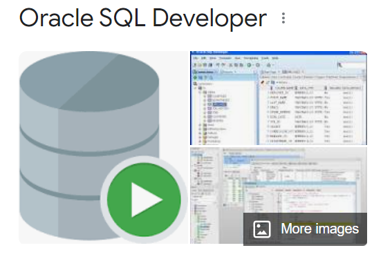
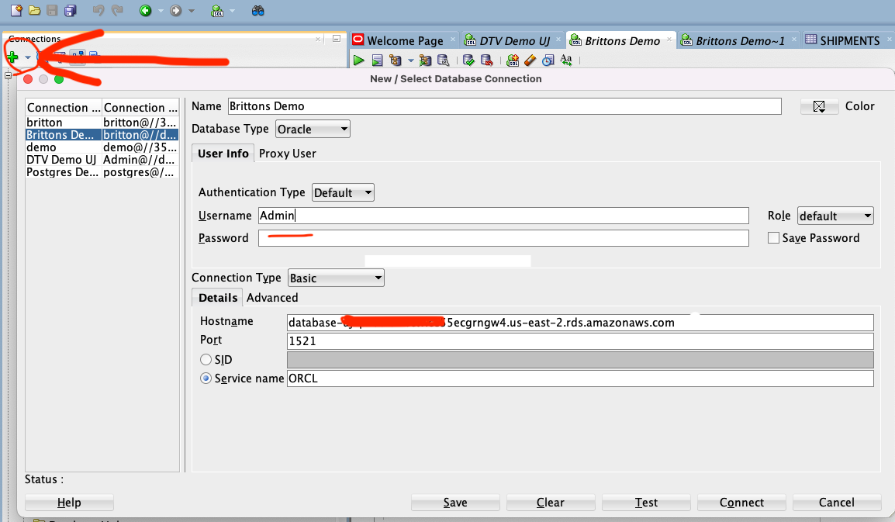
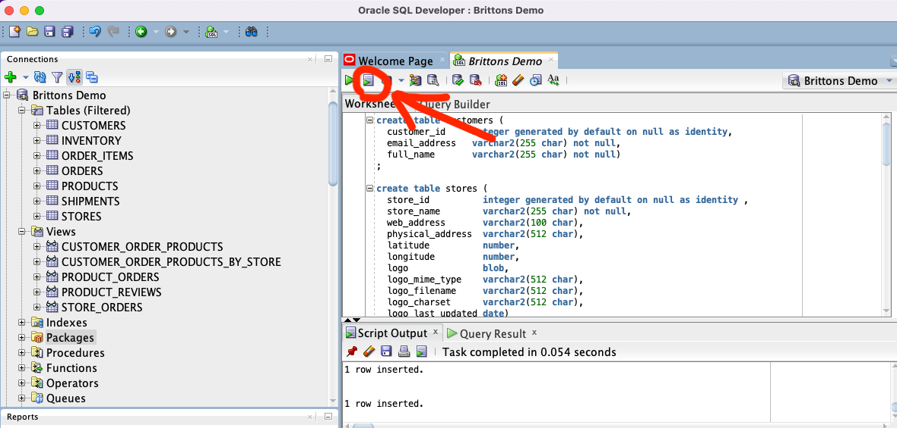
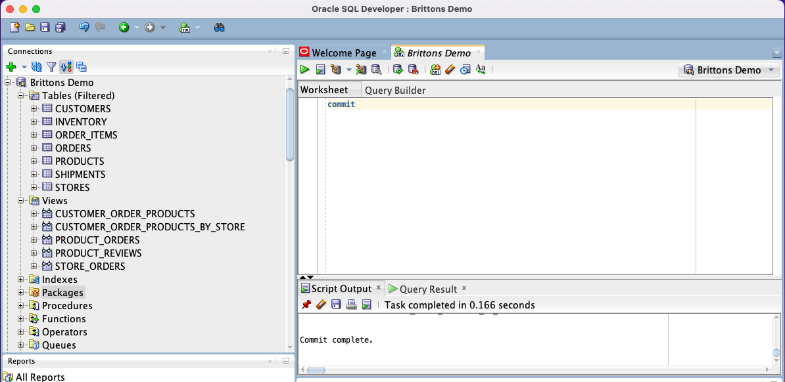
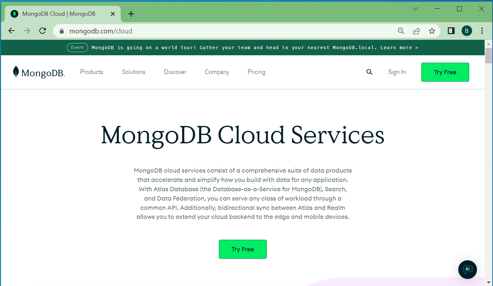

# Oracle-Confluent-MongoDB
Migrate Oracle data to MongoDB with Confluent Cloud

This is a powerful hands on lab that will show you how to migrate workloads off of Oracle into MongoDB.  This lab start by migrating live customer orders to MongoDB so that the reads can be offloaded to a modern cloud based database.  A good overview of the power of Confluent Cloud working with MongoDB Atlas is here:    

[Effective Digital Transformation with the New "Kafcongo" Tech Stack: Kafka, Confluent & MongoDB](https://www.linkedin.com/pulse/effective-digital-transformation-new-kafcongo-tech-stack-laroche/)

The following __"Hands-on Lab"__ will allow you to migrate Oracle data to MongoDB with the use of the Confluent Cloud.  Depending on your familiarity with MongoDB and The Confluent Cloud and the AWS management console, the lab can be anywhere from 60 to 90 minutes in total. Assuming you have an existing Oracle development databse accesible to the cloud you can skip the first step and use your own database.

If you don't have access to an Oracle instance, no worries we will show you how to create one in the AWS cloud. This specific hands-on lab is specific to Oracle but the same concepts apply to any JDBC compliant database. The [Confluent Hub](https://www.confluent.io/hub/) has CDC connectors for many different databases as well.

 

# Create an Oracle Database 

We begin by creating an AWS RDS instance of Oracle.  Log into your AWS Console and navigate to "RDS".  
[https://console.aws.amazon.com](https://console.aws.amazon.com)

If you want the free tier and least cost for all three servcies in AWS (Oracle RDS, MongoDB Atlas, Confluent Cloud) then I suggest Oregon US West 2. Pick the same region for Oracle, Confluent Cloud, and MongoDB Atlas. If you deploy across regions or cloud providers there is a whole networking discussion that is outside the scope of this hands-on lab.  

**Pick the same region for Oracle, Confluent Cloud, and MongoDB Atlas: Oregon US West 2**  

| Hands on Video: Setting up Oracle |
|----------------|
|[Click here to watch a 5 Minute Video on how to create an Oracle instance in AWS](https://youtu.be/FTIlO-GZ9uo)|   
|<a href="https://youtu.be/FTIlO-GZ9uo" target="video"></a>|  

[Hands on example video to install an Oracle instance](https://youtu.be/FTIlO-GZ9uo)


If you did not watch the video, be sure to modify the Security group rules and add a 0.0.0.0/0 route for inbound as well as outbound traffic.  Networking is outside the scope of this simple tutorial. Never do this with an offical environment, but its fine for this demo.  You can go back later and remove these wide open ranges when you get the IP information for Confluent Cloud, but for now this works.

| Hands on Video: Installing SQL Developer and the sample Customer Orders data |
|----------------|
|[Click here to watch a 12 Minute Video on how to load the Oracle Databse with customer orders](https://youtu.be/D1lOtF0HqGk)|   
|<a href="https://youtu.be/D1lOtF0HqGk" target="video"></a>|  

## Create the Customer Orders Schema and Populate it With Data

We begin by using the sample "Customer Orders" schema provided by Oracle Developer Advocate Chris Saxon
|Description                            | Link                                                  | 
|-----------------------------------------------|-----------------------------------------------|
| Orginal Blog| [https://blogs.oracle.com/sql/post/announcing-a-new-sample-schema-customer-orders](https://blogs.oracle.com/sql/post/announcing-a-new-sample-schema-customer-orders)|
|Main Github|[https://github.com/oracle-samples/db-sample-schemas](https://github.com/oracle-samples/db-sample-schemas)|
|Customer Orders SQL|[https://github.com/oracle-samples/db-sample-schemas/tree/main/customer_orders](https://github.com/oracle-samples/db-sample-schemas/tree/main/customer_orders)|

I recommend getting Oracle sql developer from this site, its a handy tool and a great visual interface compared to command line.  Your demo will be much better with it.

[Oracle SQL Developer Download](https://www.oracle.com/database/sqldeveloper/technologies/download/)

After you install SQL Navigator click the drop list next to the little green plus sign in the upper left of the gui and select create new connection. Use SQL Navigator to connect to your database using the credentials you specified when you created the database, Admin user and password.  The host name is provided to you in the AWS Console. The Service name is ORCL.

  

Follow the intsructions in his blog to install the tables via command line...  Or cut and paste the specific table DDL and data into SQL Navigator.

|Create the tables|
|-----------------|
|[co_tables.sql](https://github.com/oracle-samples/db-sample-schemas/blob/main/customer_orders/co_tables.sql)|

Open the sql file and cut and paste the contents into SQL Developer. Be sure to hit the arrow with a list in the top middle tool bar to execute all the statements... just copy the insert and create statements only you don't need the begin and end blocks.

  

|create the views|
|-----------------|
|[co_views.sql](https://github.com/oracle-samples/db-sample-schemas/blob/main/customer_orders/co_views.sql)|

|Load data from the SQL files into the tables in this order| Notes |
|------------------------------------|------------------------------------|
|[customers.sql](https://github.com/oracle-samples/db-sample-schemas/blob/main/customer_orders/customers.sql)| |
|[products.sql](https://github.com/oracle-samples/db-sample-schemas/blob/main/customer_orders/products.sql)||
|[stores.sql](https://github.com/oracle-samples/db-sample-schemas/blob/main/customer_orders/stores.sql)||
|[orders.sql](https://github.com/oracle-samples/db-sample-schemas/blob/main/customer_orders/orders.sql)|Only need a about a hundred|
|[order_items.sql](https://github.com/oracle-samples/db-sample-schemas/blob/main/customer_orders/order_items.sql)|Only need a about a hundred|


Oh and by the way... DO NOT FORGET TO COMMIT your work! Commit like its 1979! If you don't you may lose all your work inserting data.
 

 


Next we create a view that includes store_id and store_name.

```sql
CREATE OR REPLACE FORCE EDITIONABLE VIEW "CUSTOMER_ORDER_PRODUCTS_BY_STORE" (
    "ORDER_ID", 
    "CUSTOMER_ID", 
    "EMAIL_ADDRESS", 
    "FULL_NAME", 
    "STORE_ID", 
    "STORE_NAME", 
    "ITEMS",
    "ORDER_DATETIME", 
    "ORDER_STATUS", "ORDER_TOTAL") AS 
select c.order_id, 
    c.customer_id, 
    c.email_address, 
    c.full_name, 
    s.store_id, 
    s.store_name, 
    c.items, 
    c.order_datetime, 
    c.order_status, 
    c.order_total 
from customer_order_products c,
    stores s,
    orders o
where c.order_id = o.order_id
and o.store_id = s.store_id
```

Notice that this view selects from the customer_order_products view. If you really really care about performance in production you might consider creating materialized views.  For this example it all works just fine as is for me. My rule of thumb as a developer is get it done quickly and iterate, let the DBA schedule an unpleasant meeting with me later. Developers with this philosophy insure the need for your company to hire a really good Oracle DBA. But then again these days most developers don't write SQL.

Congratulations we are all done setting up our Oracle environment!  You can confirm the succesful install by running the following sql in SQL Developer:

```sql
select * from CUSTOMER_ORDER_PRODUCTS_BY_STORE
```

If you dont see data check each one of your tables to see if they have data.  Most likely you skipped a step.


# Create a MongoDB Atlas M0 Cluster

Now we create a new MongoDB Atlas instance.  The process begins by clicking on the folllowing url.  
[https://cloud.mongodb.com](https://cloud.mongodb.com) or [https://mongodb.com/cloud](https://mongodb.com/cloud)



Press the "Try Free" button and enter your information, or sign in with google.  Create an M0 cluster in AWS US West2 Oregon.  Set up an admin user and a demo user with read and write to any database privileges.

[Watch the 6 minute video here to get started creating the MongoDB Atlas Cluster](https://youtu.be/J61_hiFauNs)


| Hands on Video: Creating a MongoDB Atlas Cluster |
|----------------|
|[Click here to watch a 6 Minute Video on how to create an Atlas Cluster in AWS](https://youtu.be/J61_hiFauNs)|   
|<a href="https://youtu.be/J61_hiFauNs" target="video"></a>| 

Congratulations you have your first cluster up and running in just a few minutes.  The next step is to load data from Oracle through the Confluent Cloud.  Lets create a Confluent Cloud Cluster.

# Create a Confluent Cloud Cluster

# Create a JDBC Source Connector For Oracle

# Create a MongoDB Sink Connector

# Migrate live orders in real-time from Oracle to MongoDB Atlas

## Create Test Orders

```sql
create sequence order_seq start with 10000 INCREMENT by 1;
```

```sql
CREATE OR REPLACE PROCEDURE CREATE_NEW_ORDER 
(
  NBRORDS IN NUMBER DEFAULT 1 
) AS 
  vnbr_cust_id number(38,0) := 1;
  vnbr_store_id number(38,0) := 1;
  vnbr_product_id number(38,0) := 1;
  vnbr_order_id number(38,0) := 1;
  vnbr_price number(10,2) := 19.99;
  vnbr_count number(38,0) := 0;
  vnbr_failed number(38,0) := 0;
  
  l_seed VARCHAR2(100);
  
BEGIN
  l_seed := TO_CHAR(SYSTIMESTAMP,'YYYYDDMMHH24MISSFFFF');
  DBMS_RANDOM.seed (val => l_seed);
  FOR i IN 1 ..NBRORDS LOOP
  
    vnbr_count := vnbr_count +1;
    vnbr_cust_id := ROUND(DBMS_RANDOM.value(low => 1, high => 392),0);
    vnbr_product_id := ROUND(DBMS_RANDOM.value(low => 1, high => 46),0);
    vnbr_store_id := ROUND(DBMS_RANDOM.value(low => 1, high => 23),0);
    vnbr_order_id := order_seq.nextval;

    
    -- lookup the price
    BEGIN
        select unit_price into vnbr_price from products where product_id = vnbr_product_id;
        
        insert into orders (order_id, order_datetime, customer_id, order_status, store_id)
        values (vnbr_order_id, SYSDATE, vnbr_cust_id, 'COMPLETE', vnbr_store_id);
    
        insert into order_items (order_id, line_item_id, product_id, unit_price, quantity)
        values (vnbr_order_id, 1, vnbr_product_id, vnbr_price, 1);
    Exception
    when NO_DATA_FOUND then
        dbms_output.put_line('----');
        dbms_output.put_line('Error Code is '||SQLCODE);
        dbms_output.put_line('Error Message is '||sqlerrm);
        DBMS_OUTPUT.put_line('vnbr_count=' || vnbr_count );
        DBMS_OUTPUT.put_line('vnbr_order_id=' || vnbr_order_id );
        DBMS_OUTPUT.put_line('product_id=' || vnbr_product_id );
        dbms_output.put_line('No data found for this product_id order is aborted');
        vnbr_failed := vnbr_failed +1;
        null;
    END;
    
    commit;
    
  END LOOP;
  
  DBMS_OUTPUT.put_line('=================');
  DBMS_OUTPUT.put_line(NBRORDS || ' orders attempted.');
  DBMS_OUTPUT.put_line(vnbr_failed || ' orders failed.');
  DBMS_OUTPUT.put_line(NBRORDS - vnbr_failed || ' orders succeded.');
  DBMS_OUTPUT.put_line('Create New order process complete.' );

EXCEPTION
 
  when others then
    dbms_output.put_line('Error Code is '||SQLCODE);
    dbms_output.put_line('Error Message is '||sqlerrm);
    
END CREATE_NEW_ORDER;
```
